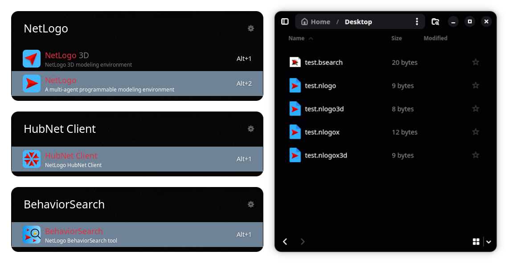

# LogoPak <a href = "https://github.com/danielvartan/logopak"></a>

<!-- badges: start -->
[](https://www.repostatus.org/#active)
[](https://github.com/danielvartan/logopak/actions/workflows/build-flatpak.yaml)
[](https://www.gnu.org/licenses/gpl-3.0)
[](https://www.contributor-covenant.org/version/3/0/code_of_conduct/)
<!-- badges: end -->

`LogoPak` is a [Flatpak](https://flatpak.org/) package for [NetLogo](https://ccl.northwestern.edu/netlogo/), a multi-agent programmable modeling environment for simulating natural and social phenomena. It simplifies the installation and management of NetLogo on Linux systems.

The package includes all four NetLogo applications (NetLogo, NetLogo 3D, HubNet Client, and Behaviorsearch) and registers desktop files, file icons, and MIME types for NetLogo model files, enabling users to use NetLogo like any other native application on their system.



> If you find this project useful, please consider giving it a star! &nbsp; [](https://github.com/danielvartan/logopak/)

> The continuous development of `LogoActions` depends on community support. If you can afford to do so, please consider becoming a sponsor. &nbsp; [](https://github.com/sponsors/danielvartan)

## Installation

`LogoPak` is not yet available on [Flathub](https://flathub.org/). To install it, you can download and install the pre-built bundle or build it locally from source. This assumes you have [Flatpak](https://flatpak.org/) installed on your system.

### Using the Pre-built Bundle

The easiest way to install `LogoPak` is by using the pre-built Flatpak bundle:

1. Download the latest Flatpak bundle from the [releases page](https://github.com/danielvartan/logopak/releases).
2. Install the bundle by running the following command in your terminal:

```bash
flatpak install --user path/to/netlogo.flatpak
```


### Building from Source

To build `LogoPak` from source, you'll need [Flatpak](https://flatpak.org/) and [`flatpak-builder`](https://docs.flatpak.org/en/latest/flatpak-builder.html) on your system. Here's how to get them using your distribution's package manager:

```bash
# On Ubuntu/Debian
sudo apt install flatpak flatpak-builder

# On Fedora
sudo dnf install flatpak flatpak-builder

# On Arch Linux
sudo pacman -S flatpak flatpak-builder
```

Next, add the [Flathub](https://flathub.org/en) repository if you haven't done so already:

```bash
flatpak remote-add --if-not-exists flathub https://flathub.org/repo/flathub.flatpakrepo
```

Now install the required runtime and [SDK](https://en.wikipedia.org/wiki/Software_development_kit):

```bash
flatpak install flathub org.freedesktop.Platform//24.08 org.freedesktop.Sdk//24.08
```

#### Building the Flatpak

With all dependencies in place, run the following commands to build `LogoPak`:

```bash
cd flatpak
flatpak-builder --force-clean build-dir com.danielvartan.netlogo.yaml
```

#### Installing Locally

Having built the package, you can now install it locally with:

```bash
cd flatpak
flatpak-builder --user --install --force-clean build-dir com.danielvartan.netlogo.yaml
```

Test your installation by running:

```bash
flatpak run com.danielvartan.netlogo
```

You can also launch the other applications:

```bash
flatpak run --command=NetLogo3D com.danielvartan.netlogo
flatpak run --command=HubNetClient com.danielvartan.netlogo
flatpak run --command=Behaviorsearch com.danielvartan.netlogo
```

Or use the lowercase aliases if you prefer:

```bash
flatpak run --command=netlogo com.danielvartan.netlogo
flatpak run --command=netlogo3d com.danielvartan.netlogo
flatpak run --command=hubnetclient com.danielvartan.netlogo
flatpak run --command=behaviorsearch com.danielvartan.netlogo
```

#### Creating a Flatpak Bundle

An easier way to distribute the application is by creating a Flatpak bundle. For that, run the following commands:

```bash
cd flatpak
flatpak-builder --repo=repo --force-clean build-dir com.danielvartan.netlogo.yaml
flatpak build-bundle repo netlogo.flatpak com.danielvartan.netlogo
```

After creating the `netlogo.flatpak` bundle, you can share it with others. Anyone can then install it with:

```bash
flatpak install netlogo.flatpak
```

## Uninstalling the Package

To remove `LogoPak` from your system, run the following command:

```bash
flatpak uninstall com.danielvartan.netlogo
```

If you want to delete all associated user data as well? Add the `--delete-data` flag:

```bash
flatpak uninstall --delete-data com.danielvartan.netlogo
```

## Contributing

[](https://www.contributor-covenant.org/version/3/0/code_of_conduct/)

Contributions are always welcome! Whether you want to report bugs, suggest new features, or help improve the code or documentation, your input makes a difference.

Before opening a new issue, please check the [issues tab](https://github.com/danielvartan/logopak/issues) to see if your topic has already been reported.

[](https://github.com/sponsors/danielvartan)

You can also support the development of `LogoPak` by becoming a
sponsor.

Click [here](https://github.com/sponsors/danielvartan) to make a
donation. Please mention `LogoPak` in your donation message.

## License

[](https://www.gnu.org/licenses/gpl-3.0)

[NetLogo](https://www.netlogo.org) is licensed under [GPL-2.0-or-later](https://www.gnu.org/licenses/old-licenses/gpl-2.0.en.html). See the [official NetLogo website](https://www.netlogo.org) for more information. `LogoPak` files are licensed under [GPL-3.0-or-later](https://www.gnu.org/licenses/gpl-3):

```text
Copyright (C) 2026 Daniel Vartanian

LogoPak is free software: you can redistribute it and/or modify it
under the terms of the GNU General Public License as published by the Free
Software Foundation, either version 3 of the License, or (at your option) any
later version.

This program is distributed in the hope that it will be useful, but WITHOUT ANY
WARRANTY; without even the implied warranty of MERCHANTABILITY or FITNESS FOR A
PARTICULAR PURPOSE. See the GNU General Public License for more details.

You should have received a copy of the GNU General Public License along with
this program. If not, see <https://www.gnu.org/licenses/>.
```

## Acknowledgments

`LogoPak` is an independent project with no affiliation to [NetLogo](https://www.netlogo.org/) or its developers.

`LogoPak` brand identity is based on the [NetLogo 7](https://www.netlogo.org/) brand identity.
